# Easy to setup BEC Automation w/ Teleporter Parallelization using OpenComputers

This is a guide on how to easily automate the BEC Multiblocks using
OpenComputers. This method allows for multiple Teleporters (henceforth
called IONodes) to run in parallel using the same Observation Array, and
thus the same Nanites. This translates to a 16x speed boost when using 16
IONodes versus using only one. It also has multiple checks to make voiding
recipes (hopefully) nearly impossible.

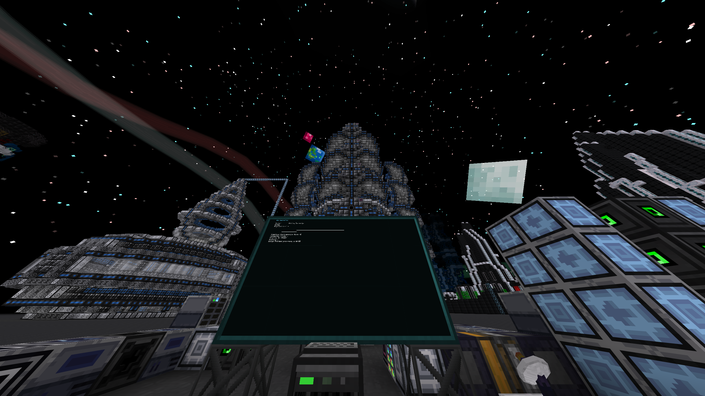

## 1. Building the Multiblocks

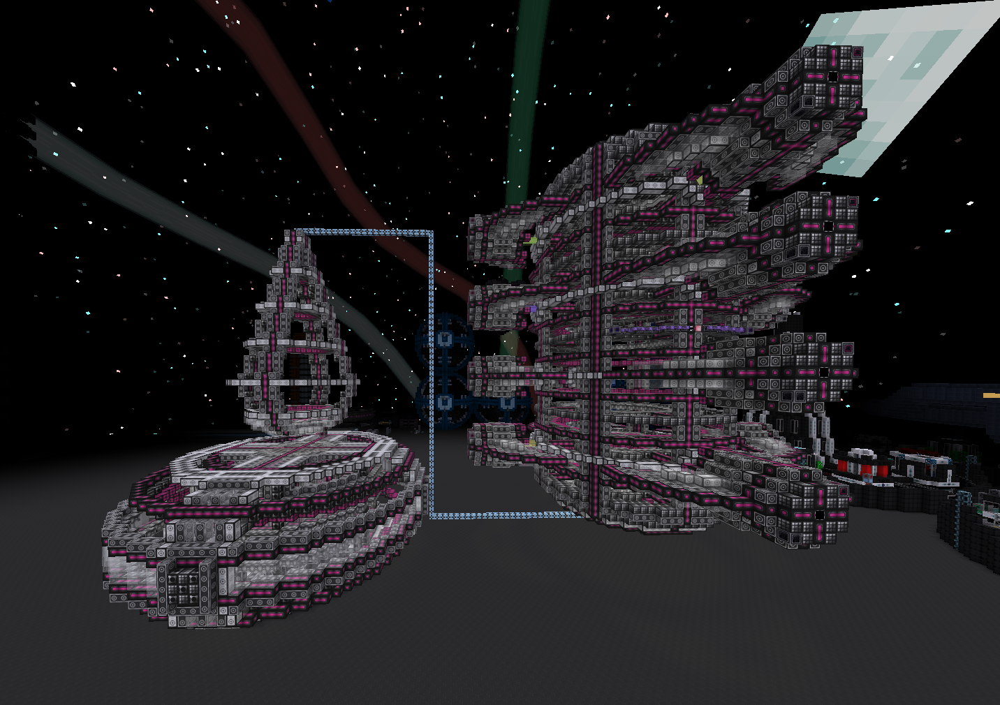

Start by building the Containment Field, Entangler, and Observation Array.
The position or location is not important, but keep them close together.

Add sufficient power hatches to each of these.
- The power given to the Entangler makes it entangle more fluids at once.
- The power given to the Containment Field increases the amount of
  Condensate it can store. It is a direct 1:1 of the EU/t and the maximum
  liters it can store. You will have to increase this to be no less than
  the most fluids you plan on processing in one batch of recipes (I have
  it set at 1 trillion). Keep in mind that this amount is a constant power
  draw.
- The power given to the Observation array caps the maximum number of
  parallels that can be done at once. You are expected to give this
  enough power so that it is never an issue.

Connect the 3 using Bose-Einstein Condensate Conduits on their Condensate
Hatches.

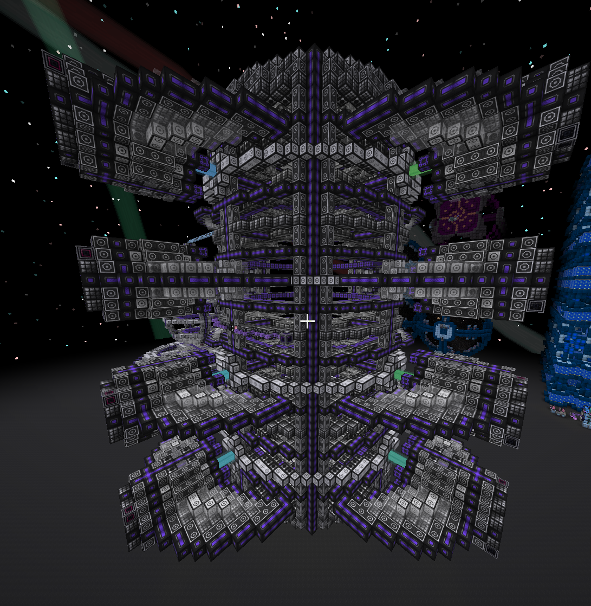

Then, build up to 16 IONodes connected to the Observation Array by
Line-of-Sight Connector Hatches like shown here.

## 2. Setting up the non-OC Automation

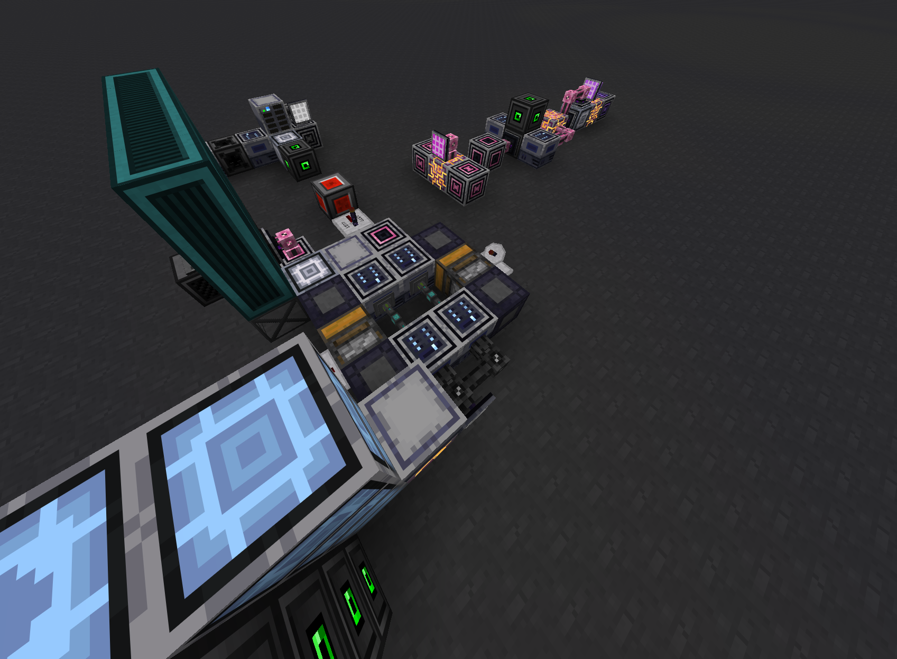

The non-OC automation side of this setup is mostly using AE2 (Obviously).
There are a few subnets to setup, we'll go through them one at a time.

### The Pending Subnet (Black)

The pending subnet is where patterns are pushed directly by your Mainnet.
We put the pattern inputs here first so that we can maintain complete and
total pattern separation.

Set it up like seen below, with Dual Interfaces, 1 Neutronium ME
Controller, 1 ME Drive, and 2 IO Ports.
- The 4 Dual interfaces seen on the left should be connected directly to
  your main network. These hold the BEC Patterns that you create. They
  should be pointing into the other 4 interfaces using a wrench. Use
  advanced blocking cards and Smart Blocking mode.
- You cannot multiply the patterns. They must be the inputs and outputs
  of exactly 1 recipe in the BEC. This is required by the OC Script so
  that it can properly identify the number of parallels that it is
  currently processing. Make sure to set "Allow pattern optimization" to
  OFF.
- The 2 IO Ports should both be filled with 3 Superluminal Acceleration
  Cards, and set to fill from network, and "Move to output when the cell
  is empty or the network has been emptied." Put a 16384k Item ME Storage
  Cell in one IO port, and a 16384k Multi-fluid Storage Cell in the
  other. They should sit unmoved in the left side of the IO Port if
  you've done it correctly.
- There is a failure case regarding fluids and IO Port drive size, I'll note that at the very end.

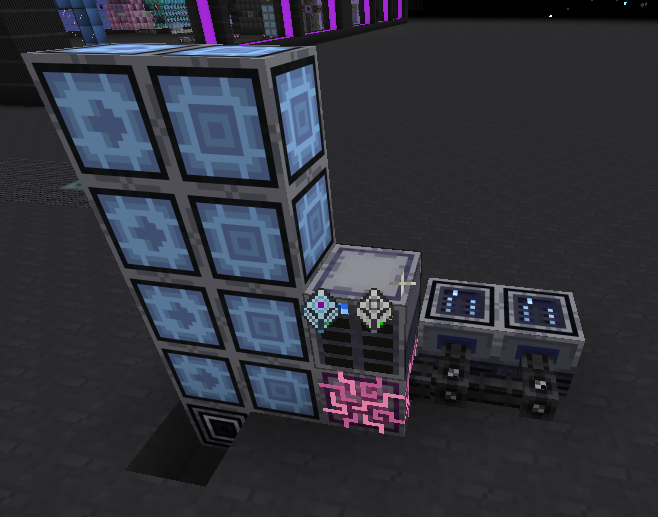
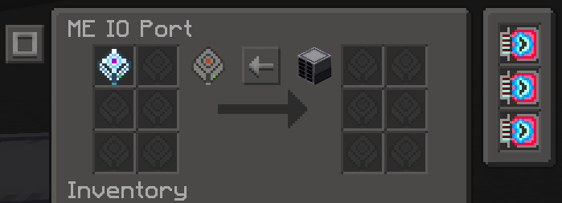

### The Input Subnet (Magenta)

The input subnet is where the items and fluids are stored after they are
taken from the Pending Subnet for them to be consumed by the BEC.

On the other side of the Pending Subnet, set it up like shown below. Make
your controller with 2 Wireless Hubs, and connect that to the Wireless
Connector shown. Next to that connector should be 2 IO Ports, an ME
Drive, and normal Interface (This cannot be a dual interface).
- The two IOPorts should get 3 Accel cards, and set to empty to network,
  and "Move to output when the cell is empty or the network has been
  emptied."
- Inside the Interface, add a dummy pattern. This pattern should be for
  1 Paper -> 1 Paper, but the result should be renamed "Input".
- Put some item and fluid storage in the drive (Make sure it has capacity
  to hold all the inputs that get sent from the pending subnet)

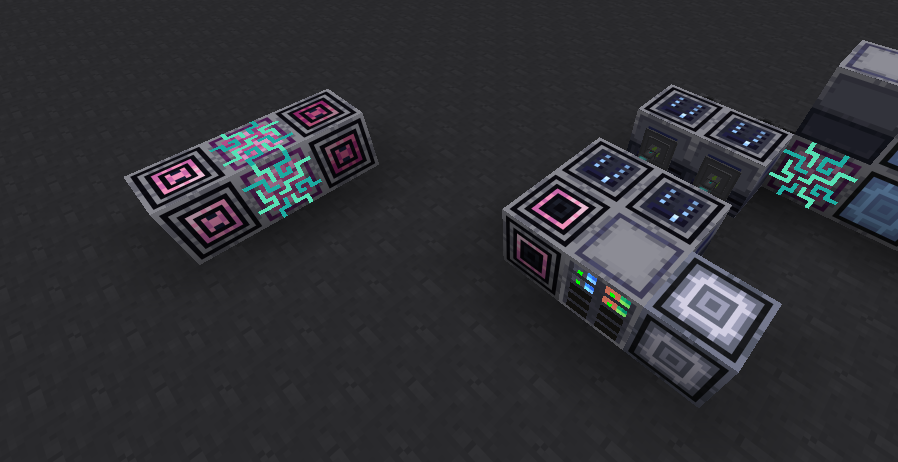
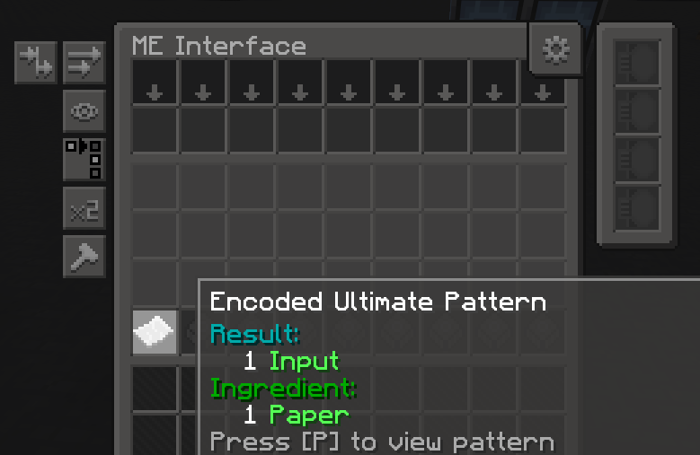

Place 2 EnderIO Item Conduits between the two sets of IO Ports. Disable
them from connecting to each other using a Yeta Wrench.
- The Pending Subnet side should be set to "Extract" and "Always Active".
- The Input Subnet side should be set to "Insert".

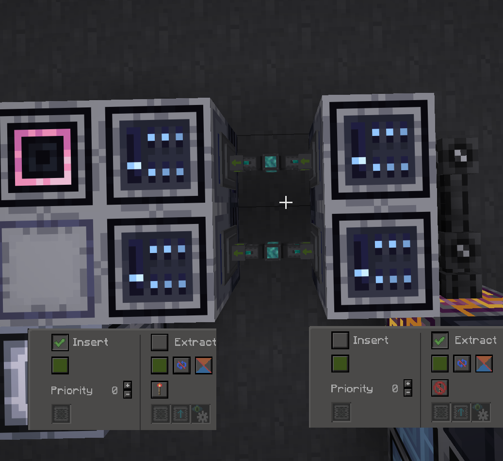

On each IONode, place an Advanced Stocking Input Bus set to auto-pull
(rotated in image for visibility). Place a Wireless Connector on it, and
connect it to one of the Hubs on the Input Subnet controller.

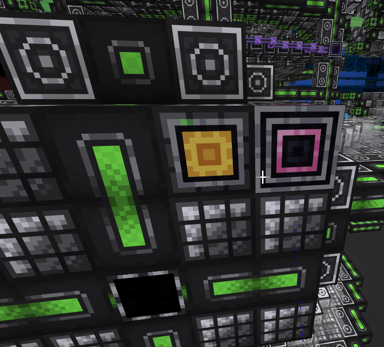

Do the same thing with the Entangler, but with an Advanced Stocking Input
Hatch. Set this to 1 tick.

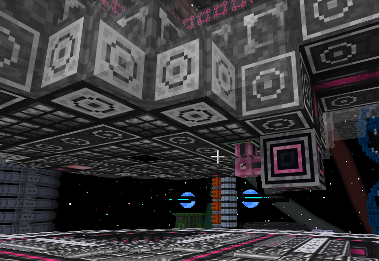

### The Output Subnet (Gray)

The output subnet simply holds the output items from each IONode until
all are finished, then they are sent out to the Mainnet.

Set it up like shown below, with 2 IO Ports, 1 Wireless Hub, 1 ME Drive,
and 1 Normal Interface (This cannot be a dual interface).
- Both IO Ports should be set like they are in the screenshot, with the
  mode as "Move to output when work is done". They should also receive
  Accel cards.
- The IO Port on the left should be connected directly to your mainnet.
  Inside that IO Port, put an item drive to bus the outputs between the
  Output subnet and your mainnet.
- The IO Port on the right, you will have to put a dummy drive in the
  5th output slot. The drive or its contents doesn't matter, just that it
  is there. You can get it there by filling it with drives, then removing
  all but the 5th one.
- Connect the Wireless Hub to ME Output Buses on each of your IONodes.
- The two IO Ports should be unconnected at this point.

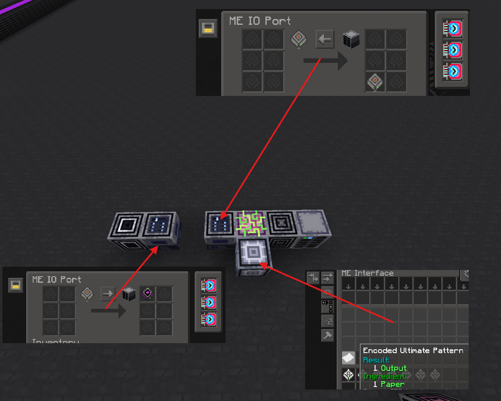

### The Nanite Subnets

The nanite subnets control the draining/filling of the nanite containment
hatches on the Observation Node.

Set it up as seen below.
- The wireless hub should be connected to 15 Nanite Containment Housings,
  as seen in the second screenshot. Each housing has a storage bus on it
  with default settings.
- The IO Ports should be setup as seen with both set to "Move to output
  when work is done".
- Note that one IO Port has a dummy drive in the 6th output slot, similar
  to the one on the Output subnet.
- The other IO Port has a 16384k Item Storage Cell, I'll detail more on
  that Storage Cell next. This will contain all of the nanites you want
  to be used in the BEC.
- There should be two Storage Bus facing into the Interface on the right
  subnet. The storage bus on the top is set to "Extract Only".
- The storage bus on the bottom is set to "Insert Only", and has an Ore
  Dictionary card in it. Set the ore dictionary filter to something
  random that won't match any nanites like "123".

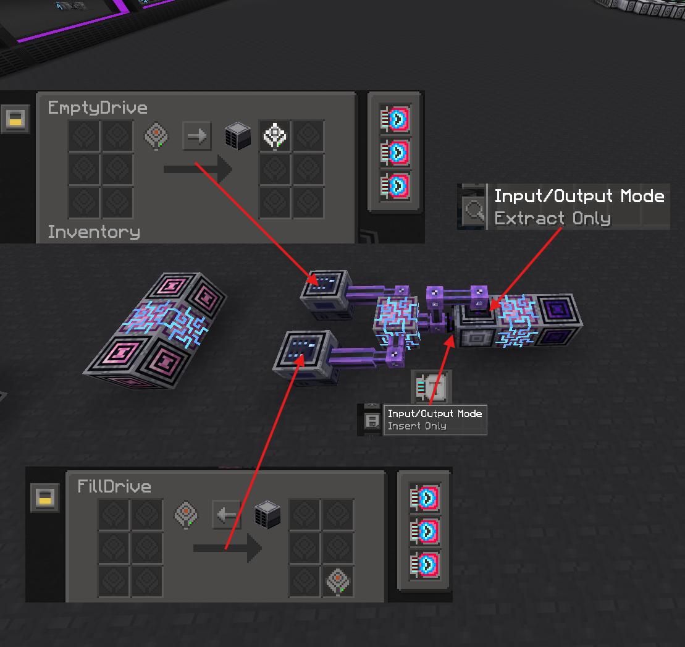
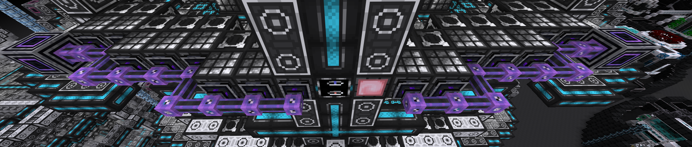

Use a Cell Workbench to partition that 16384k storage cell like below,
with 1 of each nanite, and an Equal Distribution Card.

Also, click the button next to the cell to set it's maximum Resource
Amount to 307,200.

Fill this with your nanites, then put it back in the correct IO Port on
the Nanite Subnet (the one without the dummy cell). You can remove and
put back this drive whenever the BEC is not running, and fill it with
more nanites as appropriate.

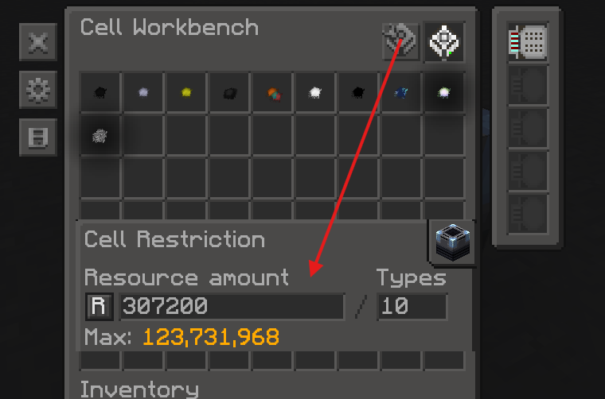

## 3. OpenComputers Setup

First, nearby setup a Rack with a Server (Tier 4) and a Disk Drive. Also
connect a Screen t3, Keyboard, and Neutronium Energy Cell.
- You can access the contents of a server/disk drive by right clicking it
  on the front face of the Rack.
- You have to use a Rack, you can't use a normal Computer.
- On the rack itself, set it up like in the screenshot. Make sure to connect the cable to the side of the rack that you indicate in the GUI.

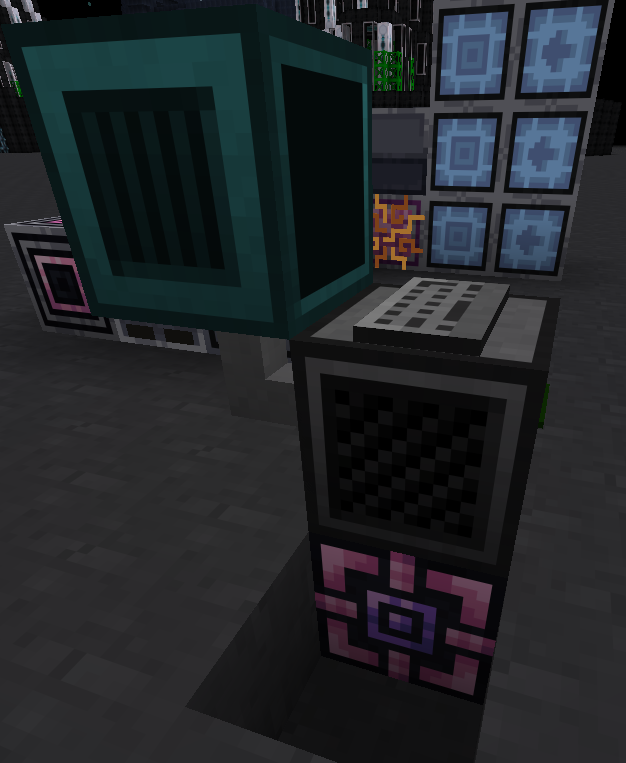
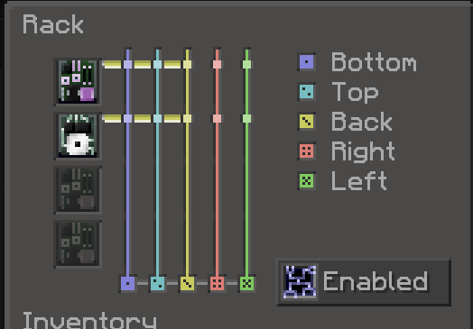

Place an OpenOS floppy in the Disk Drive, and fill the Server with the
following components.
- 1x Graphics Card T3
- 1x CPU Tier 3
- 1x Magical Memory
- 1x Component Bus (Creative)
- 1x Hard Drive T3
- 1x EEPROM Lua Bios
- 1x Internet Card

Start the computer and install OpenOS. Once done, you can remove the disk
drive entirely.

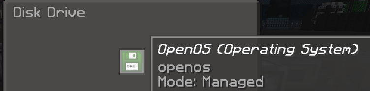
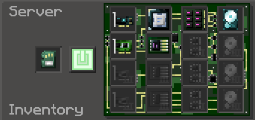

Now time to hook all the adapters up.

We will need to connect an Open Computers P2P. Use the Input Subnet to
carry the P2P.

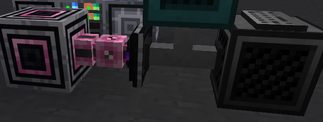

On the inside of the Entangler, hook up OC P2P to an adapter that is
touching the Entangler Controller (highlighted). Repeat for the
Containment Field. Repeat for each IONode. If you have 16 IONodes, this
means 16 Wireless Connectors into OC P2P and an Adapter.

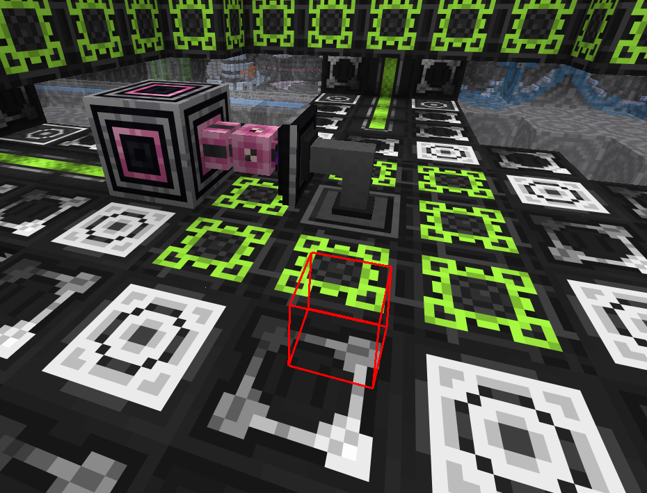
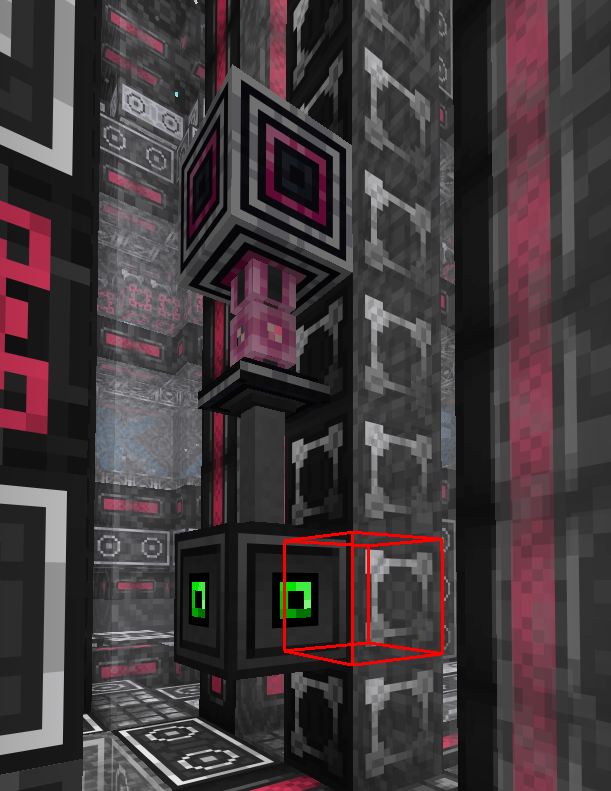
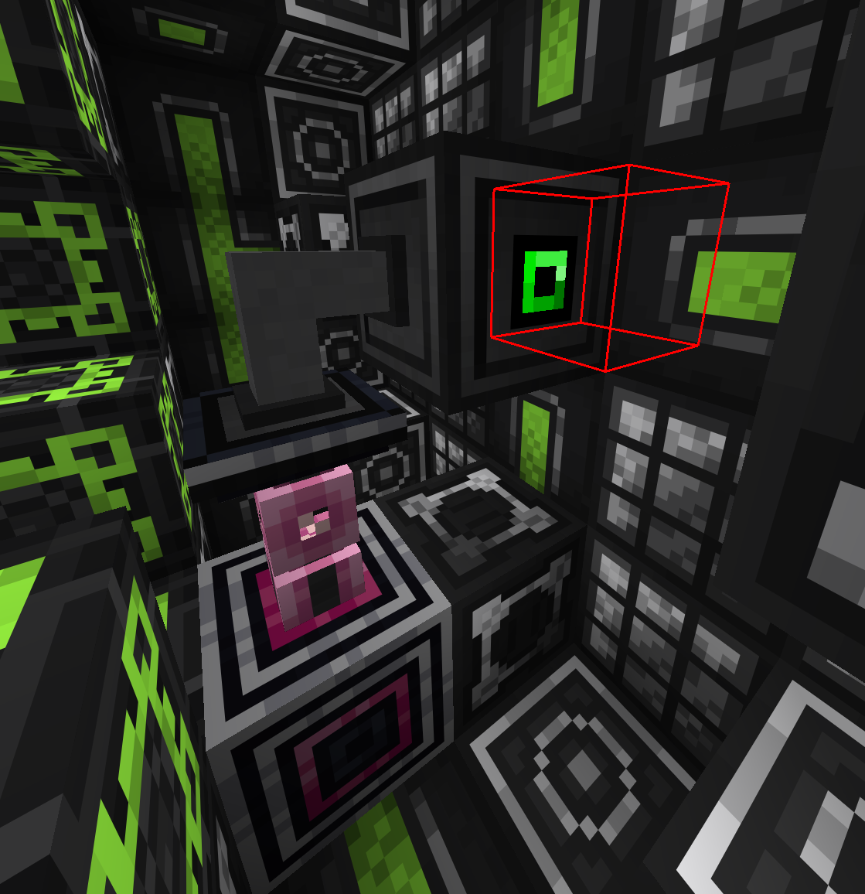

Next, we need a few Adapters for AE2, as well as two Transposers. These
can be done using P2P or by running a cable. I opted to just run cable
underground for mine. You will also need MFUs from OpenComputers. Use
these by shift right clicking a block, then placing the MFU into an
Adapter.

We need 1 Adapter that is MFU'd on the Input Subnet interface.

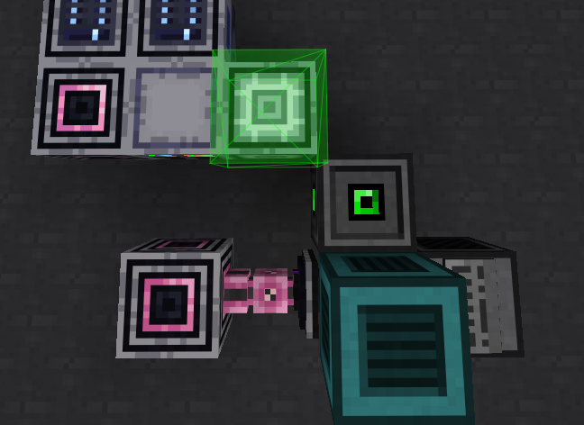

We need 1 Adapter on the Output Subnet interface. Use MFU if needed. We
also need 1 Transposer between the 2 IO Ports on the Output Subnet.

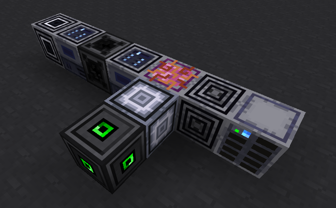

We need 1 Transposer between the 2 IO Ports on the Nanite Subnet, as well
as an Adapter on top of it. This adapter should be MFU'd on the Storage
Bus that contains the Ore Dictionary card.

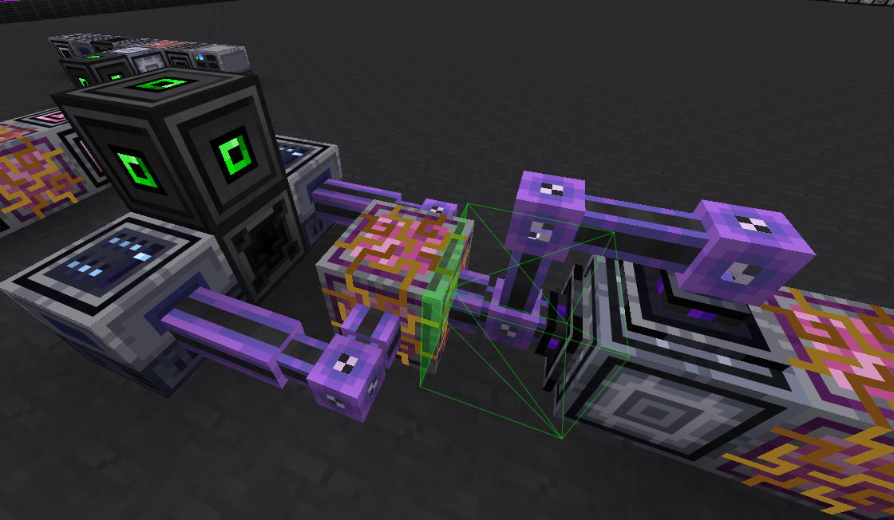

You also need one Adapter for each Dual Interface that holds patterns
from your mainnet.

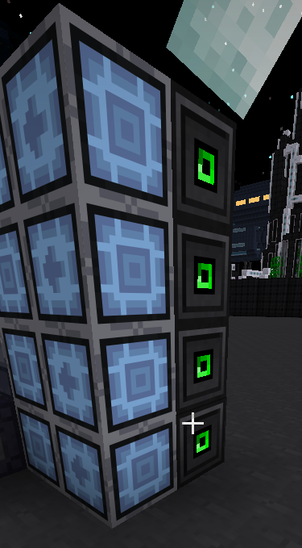

Reminder that all of these adapters and transposers need to be connected
via OpenComputers cable, either directly or via OC P2P.

## 4. Redstone I/O & Item Importers

This part is pretty simple. Add a OpenComputers Redstone I/O anywhere,
and connect it with OC Cable, and add a WR-CBE Wireless Transmitter on a
distinct frequency on any side of it. Don't use the top or bottom side.

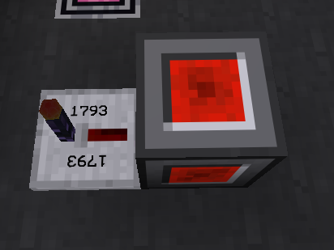

Next, set up 4 SFM Inventory Relays, and 2 ProjectRed Item Importers as
shown below. Use a wrench to make the Relays face into the IO Ports, and
make sure the Item Importers are facing the same way as shown. Add 2
WR-CBE Wireless Receivers facing the Item Importers on the same frequency
as before.

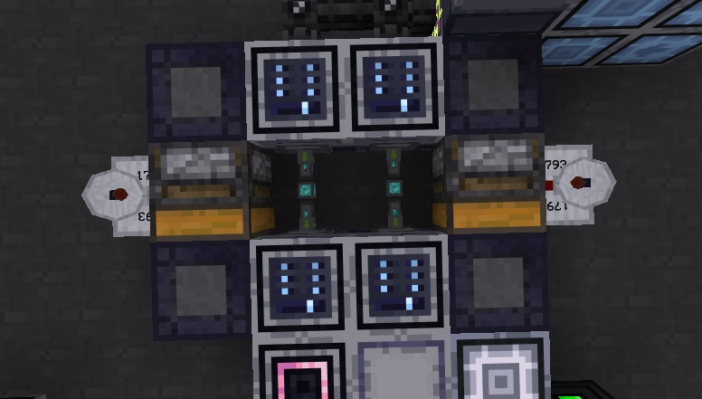

## 5. Running the BEC Controller

On your OC Computer, do the following command (use middle mouse to
paste).

```
wget https://raw.githubusercontent.com/Armisael5/gtnh-bec-controller/main/bec_controller.lua /home/bec_controller.lua && bec_controller
```

This downloads the script and runs it. On that first run it registers
itself to start automatically on every future boot, so you won't need to
run it manually again. It also checks for a newer version on
every startup and updates itself automatically if one's available.

You can use Ctrl+Alt+C to exit the script if needed while it's running.

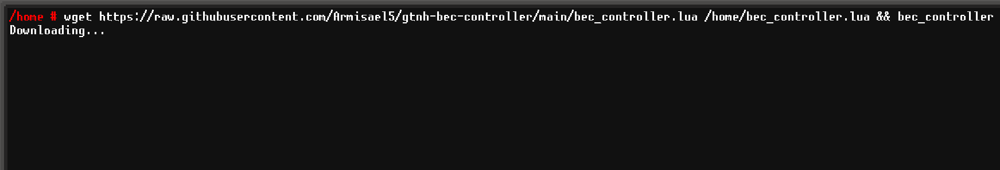

That's it!

## Common issues & notes

- **"Could not find X transposer"**: Make sure that the transposer is
  wired, the dummy drive is present in the correct IO Port, and in
  the correct slot.
- **"[UUID] never picked up work"**: Make sure each IONode properly
  forms (just being turned off is normal), and that the ASIB is properly
  connected for each.
- **"Input Subnet still has X items"**: Most likely a multiplied
  pattern.
- I mentioned regarding the Pending Subnet a niche failure case. If there
  is more fluid in the Pending Subnet than get get moved to the Input
  Subnet by the 16384k Fluid drive in the IO Port, then this may cause
  unexpected behavior. The only time this has ever been relevant to me,
  was for Singularity Reinforced Stellar Shielding Casings. I recommend
  to do those in the AAL for that reason. There may be other things that
  cause this issue in Gate craft, however at that point you can replace
  the IO Port fluid cell with an Artificial Universe fluid cell, and it
  will never be an issue. This also can happen with items, but this is only really possible for gate items (ULV Compressed Circuit Arrays), so make Artificial Universe.


  There's a Tips & Tricks post for this setup in the GT:NH Discord, feel free to drop any questions or issues you're having in there.